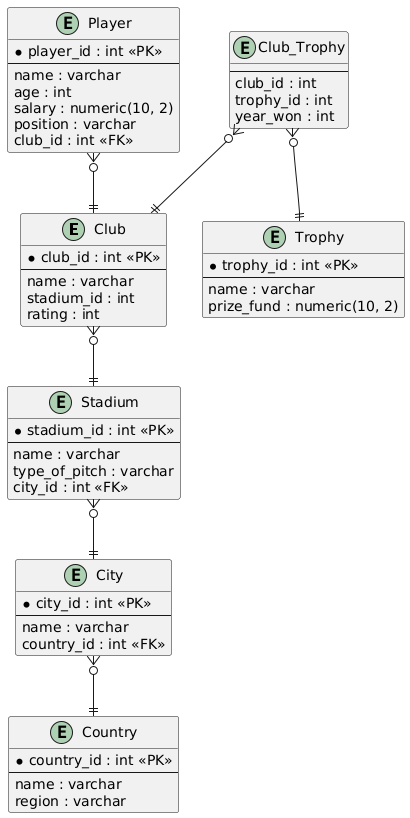

## Запуск проекта

### Требования

* Python 3.10+
* PostgreSQL

### Сборка на новом устройстве

Ниже — минимальный порядок действий, чтобы поднять проект с нуля. **После применения `ddl.sql` и `dml.sql` дополнительные скрипты из `tools/` не обязательны**: все демо-данные, включая голы и ассисты за последний сезон (`goals_last_season`, `assists_last_season`), уже входят в `sql_scripts/dml.sql`.

1. **Клонировать репозиторий** и перейти в каталог проекта.

2. **Создать виртуальное окружение (рекомендуется)** и установить зависимости:
   ```bash
   pip install -r requirements.txt
   ```

3. **Установить PostgreSQL** и создать пустую базу (имя по умолчанию в примерах — `football_service`):
   ```sql
   CREATE DATABASE football_service;
   ```

4. **Настроить подключение к БД.** Скопировать `.env.example` в `.env` в **корне репозитория** и задать как минимум `DB_PASSWORD`; при необходимости — `DB_HOST`, `DB_PORT`, `DB_NAME`, `DB_USER`. Файл `.env` в git не коммитится.

5. **Создать схему и загрузить данные** — только SQL из `sql_scripts/` (порядок важен):
   ```bash
   psql -U postgres -d football_service -f sql_scripts/ddl.sql
   psql -U postgres -d football_service -f sql_scripts/dml.sql
   ```
   В `dml.sql` уже есть страны, клубы, игроки, пользователи, трофеи, `transfermarkt_player_id` где задано, а также **голы и ассисты за последний сезон** в строках `INSERT INTO Player`.

6. **Запустить приложение** из корня репозитория:
   ```bash
   streamlit run src/main.py
   ```

**Пересоздать таблицы и данные с нуля:** выполнить `sql_scripts/drop.sql`, затем снова шаги 5–6.

### Скрипты в `tools/` (не путать с шагом 5)

Минимальная сборка — только `ddl.sql` и `dml.sql`. Для медиаконтента оставлена одна утилита:

| Задача | Скрипт |
|--------|--------|
| Загрузка портретов в S3 и запись `photo_url` в БД | `python tools/upload_player_photos_to_s3.py` |

Подробнее про S3 и фолбэк-источники фото — раздел [Фото игроков (S3, Sports.ru, Wikipedia)](#фото-игроков-s3-sportsru-wikipedia) ниже.

### Краткая шпаргалка (уже настроенный ПК)

1. `pip install -r requirements.txt`
2. `.env` из `.env.example`
3. `psql ... -f sql_scripts/ddl.sql` и `psql ... -f sql_scripts/dml.sql`
4. `streamlit run src/main.py`

> При необходимости пересоздать таблицы — сначала выполнить `sql_scripts/drop.sql`, затем снова применить `ddl.sql` и `dml.sql`.

### Конфигурация и продакшн

* **Секреты:** пароль и параметры БД задаются только через `.env` (локально), переменные окружения на сервере или **Secrets** в панели хостинга (например, Streamlit Community Cloud). Пример ключей для облака — в `.streamlit/secrets.toml.example`; реальный `secrets.toml` с паролями в репозиторий не добавляйте.
* **SSL:** для управляемых БД (облако) часто нужен TLS — задайте `DB_SSLMODE=require` (или `verify-full`) в `.env` / секретах.
* **Сеть:** в продакшн ограничьте доступ к PostgreSQL по IP/ VPC, не открывайте порт 5432 в интернет без необходимости.
* **Приложение:** выкладывайте за обратным прокси с HTTPS; не храните пароли и ключи в коде.

### Подклассы игроков

Справочник **`player_subtype`** задаёт тактический тип внутри амплуа (`position_category`: Вратарь, Защитник, Полузащитник, Нападающий). У каждого игрока поле **`subtype_id`** обязательно и ссылается на этот справочник. Заполнение — из **`dml.sql`** (при обновлении данных правьте SQL-скрипт напрямую).

### Фото игроков (S3, Sports.ru, Wikipedia)

1. Основной рабочий атрибут для интерфейса — **`photo_url`** в таблице `player`. Поле **`transfermarkt_player_id`** оставлено в схеме как совместимое/историческое, но текущий пайплайн загрузки фото на него не опирается.

2. **Рекомендуемый прод-поток:** один раз выполнить **`python tools/upload_player_photos_to_s3.py`** (из корня репозитория, с заполненным `.env`: `DB_*`, `S3_BUCKET`, `AWS_REGION`, `AWS_ACCESS_KEY_ID`, `AWS_SECRET_ACCESS_KEY`, опционально `S3_PUBLIC_BASE_URL` для CloudFront, `S3_ENDPOINT_URL` для MinIO). Скрипт ищет фото игрока по цепочке **Sports.ru -> Wikipedia**, загружает найденный файл в бакет и записывает **публичный HTTPS URL** в **`player.photo_url`**. Для отдельной обработки только свободных агентов доступен флаг `--free-agents-only`.

3. **Интерфейс:** если **`photo_url` заполнен** (в т.ч. после S3), карточки берут картинку по этому URL. Если `photo_url` пустой, интерфейс показывает локальную дефолтную иконку игрока без дополнительных внешних запросов.

4. Для бакета в AWS включите **публичное чтение** объектов по префиксу `players/` (или отдавайте тот же путь через CloudFront и укажите базовый URL в `S3_PUBLIC_BASE_URL`).

**Важно:** права на изображения и правила сторонних источников остаются на стороне пользователя; для публичного коммерческого продукта предпочтительны собственные медиа или лицензированные источники.

---

## Описание моделей

### Модели предметной области

1. **Country**

    Содержит данные о странах, связанных с городами и клубами.

    **Атрибуты:**
    * `country_id`: Уникальный идентификатор страны (первичный ключ).
    * `name`: Название страны.
    * `region`: Регион, к которому относится страна.

2. **City**

    Хранит данные о городах, связанных со странами и стадионами.

    **Атрибуты:**
    * `city_id`: Уникальный идентификатор города (первичный ключ).
    * `name`: Название города.
    * `country_id`: Внешний ключ, указывающий на страну.

3. **Stadium**

    Содержит информацию о стадионах, связанных с городами.

    **Атрибуты:**
    * `stadium_id`: Уникальный идентификатор стадиона (первичный ключ).
    * `name`: Название стадиона.
    * `type_of_pitch`: Тип покрытия стадиона.
    * `city_id`: Внешний ключ, указывающий на город.

4. **Club**

    Хранит данные о футбольных клубах, включая их стадионы и рейтинги.

    **Атрибуты:**
    * `club_id`: Уникальный идентификатор клуба (первичный ключ).
    * `name`: Название клуба.
    * `stadium_id`: Внешний ключ, указывающий на стадион клуба.
    * `rating`: Рейтинг клуба (от 0 до 100).

5. **Player**

    Содержит информацию об игроках и их клубах.

    **Атрибуты:**
    * `player_id`: Уникальный идентификатор игрока (первичный ключ).
    * `name`: Имя игрока.
    * `age`: Возраст игрока.
    * `salary`: Зарплата игрока.
    * `subtype_id`: Внешний ключ на справочник **player_subtype** (обязателен).
    * `photo_url`: Опциональный прямой URL изображения игрока для карточек интерфейса.
    * `transfermarkt_player_id`: Историческое/совместимое поле для внешнего ID игрока.
    * `club_id`: Внешний ключ, указывающий на клуб (NULL — свободный агент).
    * `nationality_country_id`: Гражданство — внешний ключ на **Country** (без дублирования названия страны в строке игрока, 3НФ).
    * `goals_last_season`, `assists_last_season`: Голы и передачи за последний завершённый сезон (иллюстративные данные в `dml.sql`).

**player_subtype** (справочник подклассов): `subtype_id`, `name` (название подкласса), `position_category` (амплуа).

6. **Trophy**

    Хранит данные о трофеях, разыгрываемых в футбольных турнирах.

    **Атрибуты:**
    * `trophy_id`: Уникальный идентификатор трофея (первичный ключ).
    * `name`: Название трофея.
    * `prize_fund`: Призовой фонд трофея.

7. **Club_Trophy**

    Связывает клубы с выигранными трофеями и годом победы.

    **Атрибуты:**
    * `club_id`: Внешний ключ, указывающий на клуб.
    * `trophy_id`: Внешний ключ, указывающий на трофей.
    * `year_won`: Год победы.
    * Композитный первичный ключ: (`club_id`, `trophy_id`, `year_won`).

8. **Users**

    Представляет данные всех пользователей системы.

    **Атрибуты:**
    * `user_id`: Уникальный идентификатор пользователя (первичный ключ).
    * `username`: Уникальное имя пользователя.
    * `password`: Хэш пароля пользователя.
    * `role`: Роль пользователя (например, "user" или "admin").

---

## Основной функционал

### Back-End

Реализован на **psycopg2** для взаимодействия с PostgreSQL. Основной функционал:
- Получение данных о клубах, игроках, трофеях, стадионах и городах.
- Фильтрация клубов по рейтингу, стадионам и другим параметрам.
- Аутентификация пользователей.

### Front-End

Создан на **Streamlit** для интерактивного взаимодействия с пользователем. Основной функционал:
- Отображение списка футбольных клубов.
- Фильтрация клубов по заданным параметрам.
- Карточки игроков с голами и передачами за последний сезон; скаут с фильтрами по статистике; страница **«Рекомендации по профилю»** (вариант B: взвешенное расстояние до целевой точки по возрасту, зарплате, голам и передачам).
- Визуализация данных в виде таблиц и графиков.

---

## Диаграмма модели



Актуальная схема связей таблиц (Mermaid, для просмотра в GitHub / VS Code): [db_structure/er_diagram.mmd](db_structure/er_diagram.mmd).

---

## Пример использования

1. Пользователь заходит в интерфейс Streamlit.
2. Выбирает фильтры для клубов (например, по рейтингу или стадиону).
3. Front-End передает запрос на Back-End для выполнения операции.
4. Back-End возвращает отфильтрованные данные, которые отображаются в интерфейсе.

---

## Комментарии к проекту

Проект реализует основные CRUD-операции с базой данных и позволяет интерактивно получать данные о футбольных клубах, игроках и трофеях, что делает его полезным инструментом для футболистов в поиске подходящего клуба.

